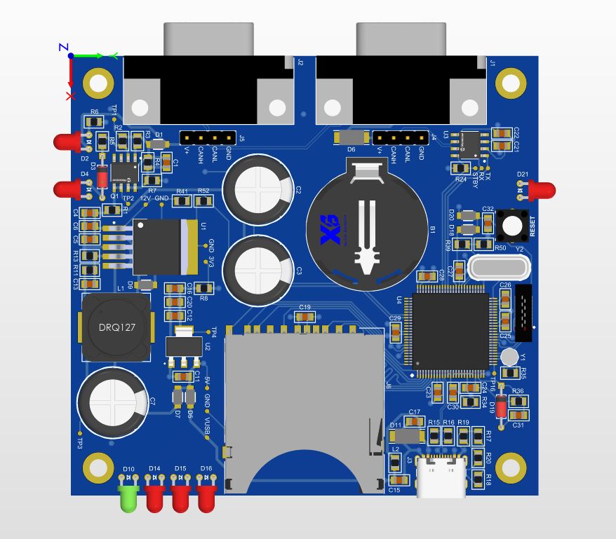
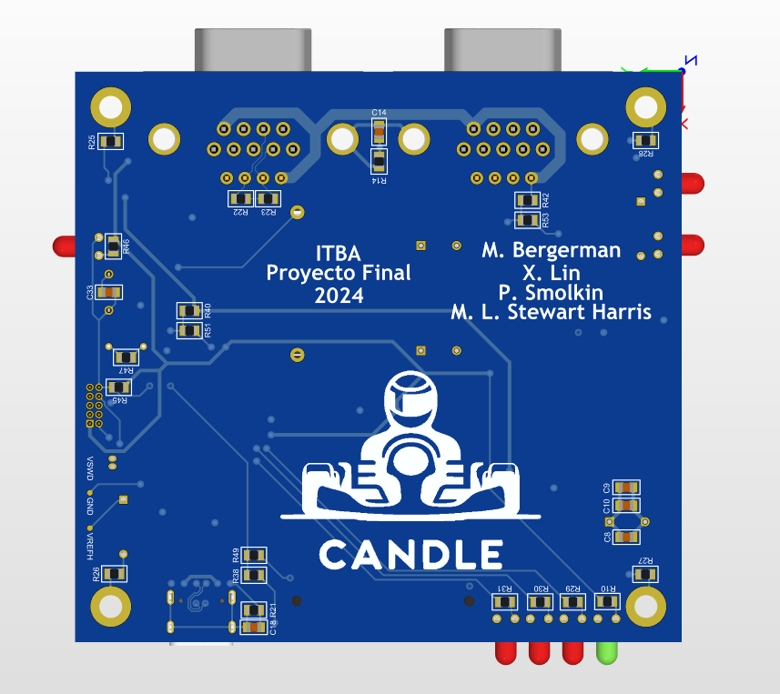
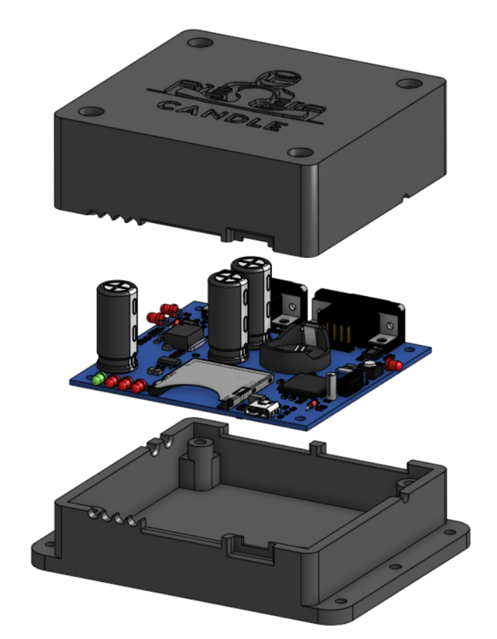
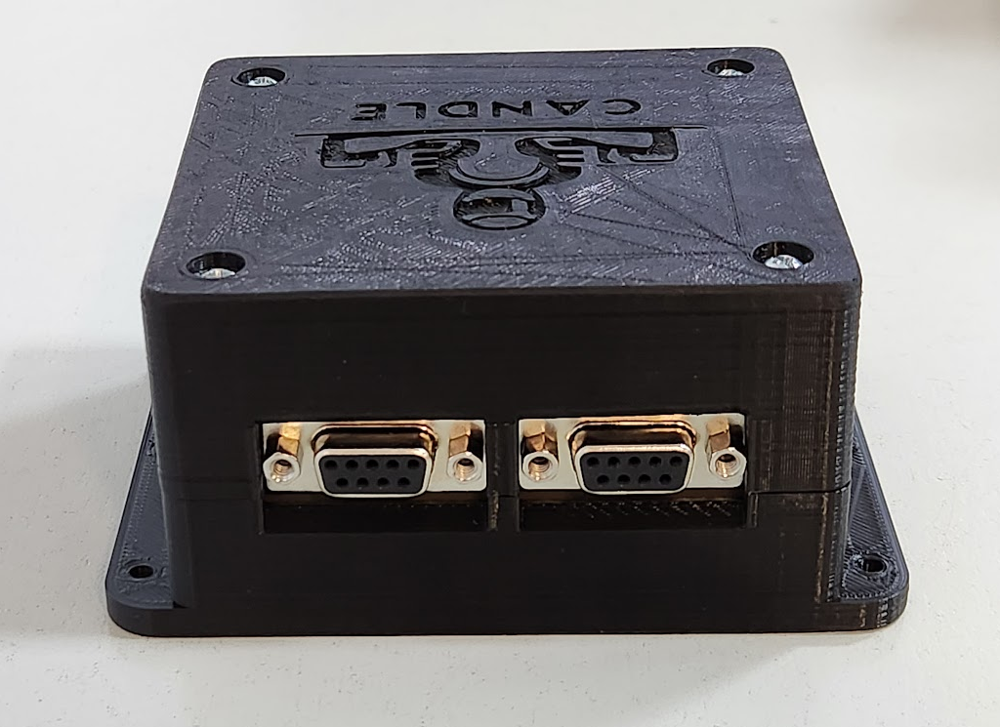
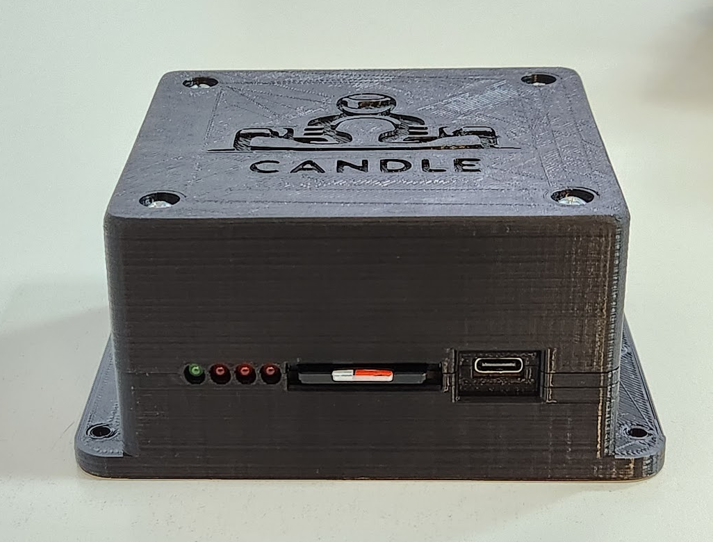

# CAN Data Logger Electronic Board (CANDLE)
PCB design for the CAN Data Logger.

The CANDLE board is designed to be used inside an electric vehicle prototype in order to assist with debugging and diagnostics during the design. These are the main features of the device:

* The CANDLE connects to the vehicles CAN bus and records all message frames together with a timestamp (1ms precision) in CSV format on an SD card.
* A USB Type-C connector allows for a computer to easily interface with the contents on the SD card to view the recorded messages.
* An overvoltage, reverse voltage, and ESD protection circuit ensure the safety of the device. The device functions with a voltage in the range 8V~30V and withstands voltages in the range -30V~60V.
* In the event of a sudden power outage, the CANDLE board is able to store all buffered CAN messages safely on the SD card (using bulk capacitors).

## Realistic view

  

## Box assembly

## Pictures

  